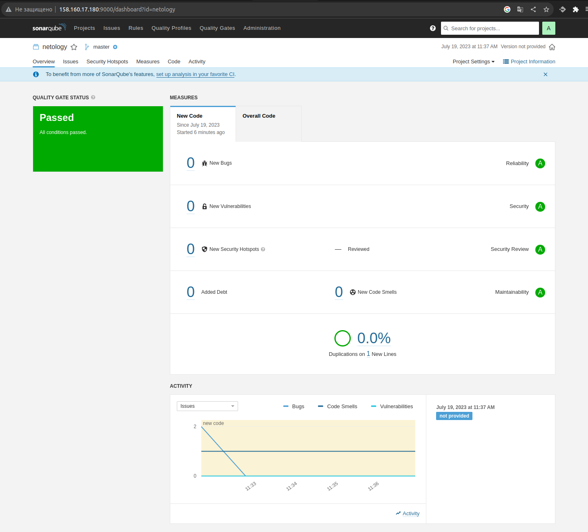

# Домашнее задание к занятию 9 «Процессы CI/CD»

## Знакомоство с SonarQube

### Основная часть


Сделайте скриншот успешного прохождения анализа, приложите к решению ДЗ.



## Знакомство с Nexus

### Основная часть

В ответе пришлите файл `maven-metadata.xml` для этого артефекта.

[maven-metadata.xml](./maven-metadata.xml)

### Знакомство с Maven

### Подготовка к выполнению

```
➜  conf mvn --version
Apache Maven 3.9.3 (21122926829f1ead511c958d89bd2f672198ae9f)
Maven home: /home/stade/old/apache-maven-3.9.3
Java version: 13.0.1, vendor: Oracle Corporation, runtime: /opt/jdk-13.0.1
Default locale: ru_RU, platform encoding: UTF-8
OS name: "linux", version: "5.19.0-46-generic", arch: "amd64", family: "unix"
```


### Основная часть

В ответе пришлите исправленный файл `pom.xml`.

```xml
<project xmlns="http://maven.apache.org/POM/4.0.0" xmlns:xsi="http://www.w3.org/2001/XMLSchema-instance"
  xsi:schemaLocation="http://maven.apache.org/POM/4.0.0 http://maven.apache.org/xsd/maven-4.0.0.xsd">
  <modelVersion>4.0.0</modelVersion>
 
  <groupId>netology</groupId>
  <artifactId>java</artifactId>
  <version>8_282</version>
   <repositories>
    <repository>
      <id>my-repo</id>
      <name>maven-public</name>
      <url>http://158.160.75.32:8081/repository/maven-public/</url>
    </repository>
  </repositories>
  <dependencies>
<!--     <dependency>
      <groupId>somegroup</groupId>
      <artifactId>someart</artifactId>
      <version>somevers</version>
      <classifier>someclass</classifier>
      <type>sometype</type>
    </dependency> -->
  </dependencies>
</project>
```

```
[INFO] Building jar: /home/stade/workdir/mnt-homework/ cicd1/mvn/target/java-8_282.jar
[INFO] ------------------------------------------------------------------------
[INFO] BUILD SUCCESS
[INFO] ------------------------------------------------------------------------
[INFO] Total time:  7.117 s
[INFO] Finished at: 2023-07-19T13:30:14+03:00
[INFO] ------------------------------------------------------------------------
```
